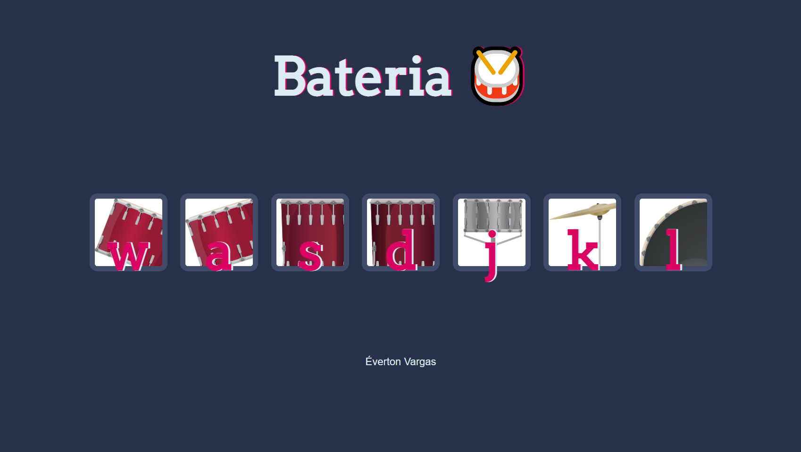

### Manipulando o DOM

A contrução desse site permitiu entender como funciona e manipula-se o DOM com Javascript.

>Ao tocar em cima de determinado instrumento
o som respectivo é emitido. Simulando a
batida da baqueta em uma bateria.

  

